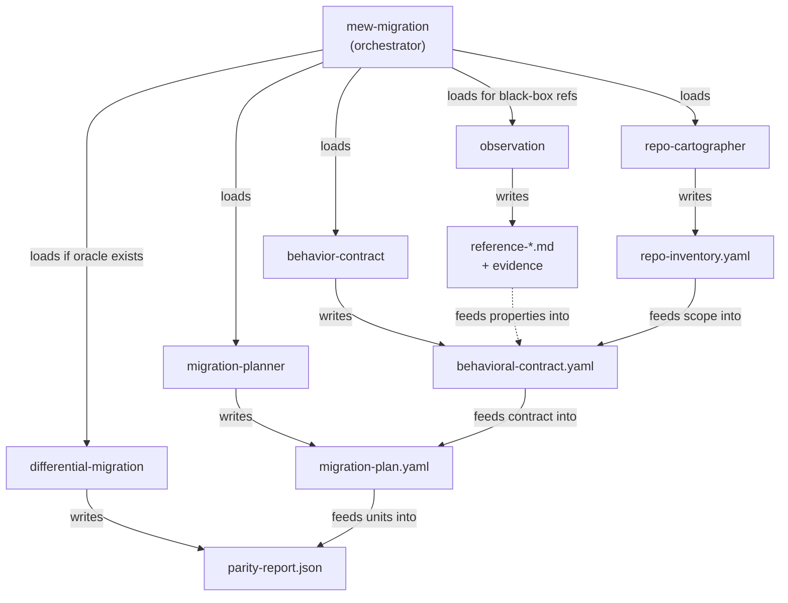
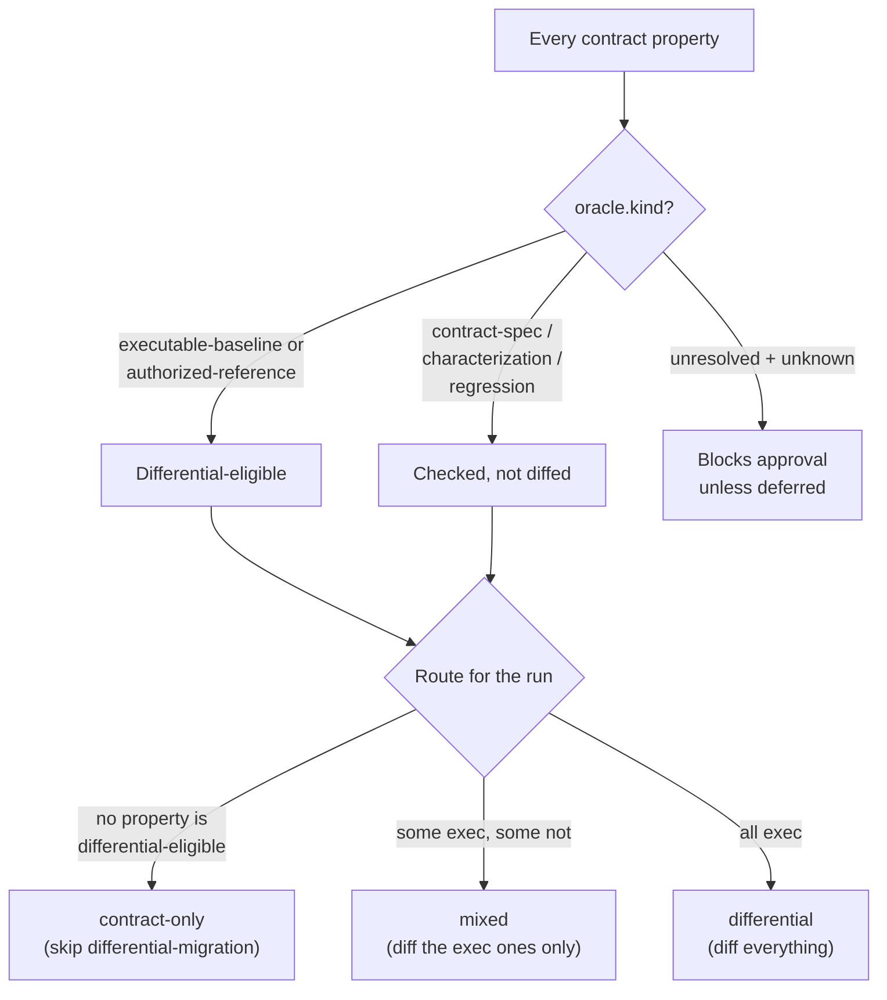
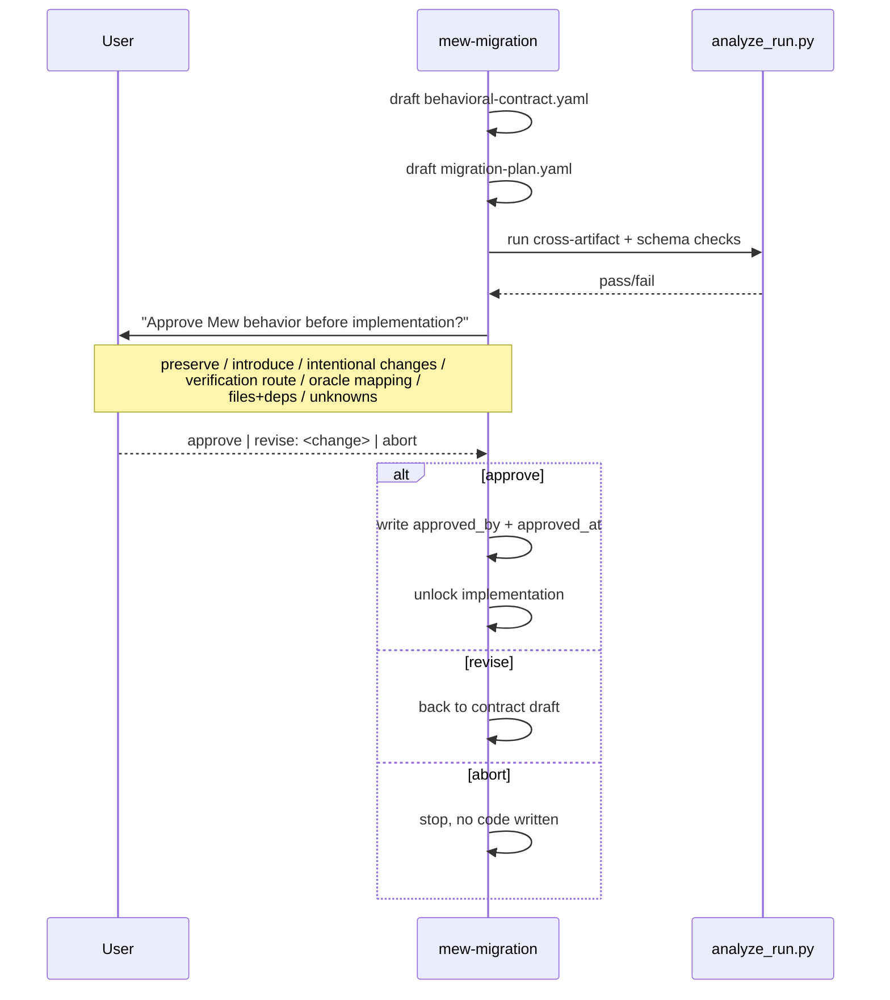
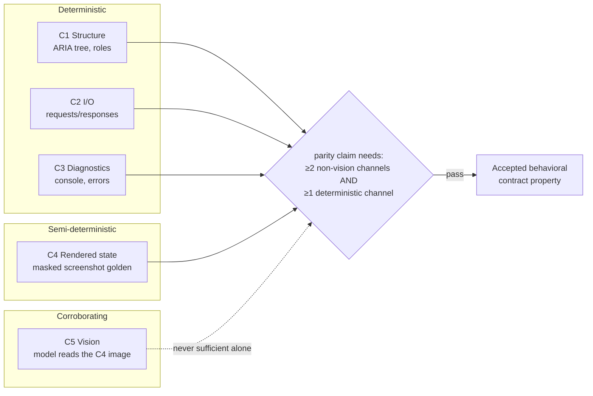
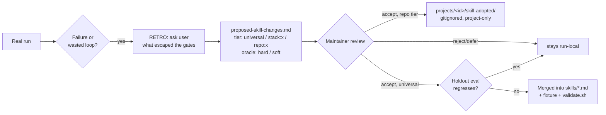

# How mew-skills works (visual)

Diagrams over prose. Every diagram here mirrors a rule already written in the
`skills/*/SKILL.md` files — this doc does not add new behavior, it makes the
existing behavior scannable. GitHub renders the Mermaid blocks natively; no
extra tooling needed.

## 1. The whole run, end to end

```mermaid
flowchart LR
    A[User request] --> B[mew-migration<br/>intake + lock]
    B --> C[repo-cartographer<br/>INGEST]
    C --> D[behavior-contract<br/>OBSERVE]
    D --> E[GRILL<br/>resolve ambiguity]
    E --> F[behavioral-contract.yaml<br/>CONTRACT]
    F --> G[migration-planner<br/>MIGRATION PLAN]
    G --> H{HUMAN<br/>APPROVAL}
    H -- revise --> F
    H -- abort --> Z[Stop, report evidence]
    H -- approve --> I[differential-migration<br/>IMPLEMENT + VERIFY]
    I --> J[parity-report.json]
    J --> K[HANDOFF]
    K --> L[RETRO]
    L --> M[proposed-skill-changes.md]

    style H fill:#ffd966,stroke:#333,stroke-width:2px
    style Z fill:#f4a3a3,stroke:#333
```



One orchestrator (`mew-migration`), five phase skills, one hard stop for human
approval before anything gets written to production code.

## 2. Who owns what



Every phase skill writes exactly one canonical artifact and appends to the
shared `evidence.jsonl`. Nobody overwrites another skill's artifact.

## 3. The verification route decision (oracle presence)

This is the logic buried in `mew-migration`'s "Verification route" section —
the thing that decides whether `differential-migration` gets loaded at all.



A greenfield feature adoption with no old implementation to compare against
almost always lands on `contract-only` — most requests never need
`differential-migration` loaded at all.

## 4. What a run looks like on disk

```
<target>/.mew/runs/<run-id>/
├── migration-request.json      ← intake, validated against migration-request.schema.json
├── manifest.json                ← run identity, source commit lock
├── repro.json                   ← pinned build/test/bench environment
├── provenance.json              ← license + SBOM-style tracking
├── repo-inventory.yaml          ← from repo-cartographer
├── reference-<name>.md          ← from observation / reference-inspection (one per reference)
├── behavioral-contract.yaml     ← from behavior-contract  (approved_by + approved_at gate)
├── migration-plan.yaml          ← from migration-planner
├── parity-report.json           ← from differential-migration (skipped if contract-only)
├── run-state.json               ← durable W### work-item ledger, survives compaction
├── evidence.jsonl                ← one JSON line per observed fact, append-only
└── proposed-skill-changes.md    ← written at RETRO, never auto-merged
```

Every file above has a matching file in `schemas/`. `scripts/validate_run.py`
fails the run if any artifact drifts from its schema — this is a deterministic
gate, not a vibe check.

## 5. The approval gate, concretely



Nothing under step 8 (Implement and verify) in `mew-migration/SKILL.md` runs
before this exchange happens.

## 6. Observation's 5-channel model (today: Web/Playwright only)



A screenshot plus a vision model looking at it is **one** channel, not two —
it can never pass parity by itself. This is the rule that stops "the AI looked
at a screenshot and said it matches" from counting as evidence.

## 7. The self-healing loop



A run can *propose* a change to the shared pack. It can never merge one. Only
a human, after a holdout check, promotes anything to `universal`.

## Today vs. tomorrow

**Today**, `observation`'s only shipped driver is Web/Playwright, and it's
still fairly manual: someone (agent or human) has to drive the browser through
locators, capture the 5 channels, and write `reference-<name>.md` by hand per
scenario. It works, but it's scripted observation, not autonomous exploration.

**Once [`tripplen23/mew`](https://github.com/tripplen23/mew) matures** — a
proper computer-use runtime instead of a scripted Playwright driver — the plan
is for `observation` to plug into it as a second driver profile alongside
Web/Playwright (see the driver-profile table in `skills/observation/SKILL.md`):
the same authorization gate, the same 5-channel model, the same
multi-channel-parity rule, but the exploration itself (finding flows, trying
inputs, noticing edge states) becomes agentic instead of pre-scripted. That
turns `reconstruction` from "the agent replays scenarios a human enumerated"
into "the agent explores an authorized reference and proposes its own
scenario coverage, still gated by the same C1–C5 evidence rule before
anything becomes a contract property." The contract, approval gate, and
parity rules in this doc do not change — only how C1–C4 evidence gets
captured does.
